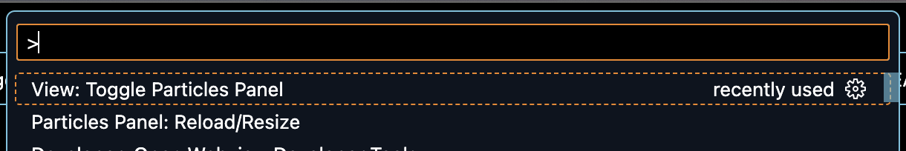

## Usage

After installing the extension, run `View: Toggle Particles Panel` in your command palette (Cmd + Shift + P in MacOS)

If you resized the panel, you'll have to run `Particles Panel: Reload/Resize` to update the canvas size.

## Features

- Displays Particles in your bottom panel
- Adds new particles when clicked
- Can be moved to the primary/secondary sidebar

## Known Issues

- Canvas does not resize live. Workaround is to use `Particles Panel: Reload Resize` in your Command Palette
- Currently only visible in dark mode

Please submit issues to bytehala/particles-panel Github repository.

## Release Notes

### 0.0.5

Added "Usage" section to README

### 0.0.4

Added icon for Extension Marketplace listing, updated README

### 0.0.1

Initial release of `particles-panel`
