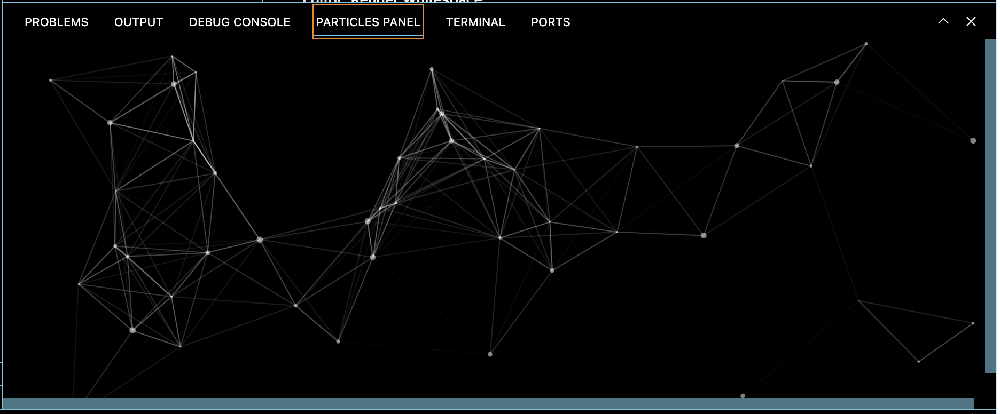

## Features

- Displays Particles in your bottom panel
- Can be moved to the primary/secondary sidebar

> Tip: Many popular extensions utilize animations. This is an excellent way to show off your extension! We recommend short, focused animations that are easy to follow.

## Known Issues

- Canvas does not resize live. Workaround is to use `Particles Panel: Reload Resize` in your Command Palette
- Currently only visible in dark mode

Please submit issues to bytehala/particles-panel Github repository.

## Release Notes

Users appreciate release notes as you update your extension.

### 0.0.1

Initial release of `particles-panel`
